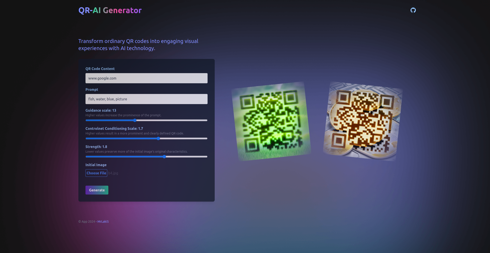
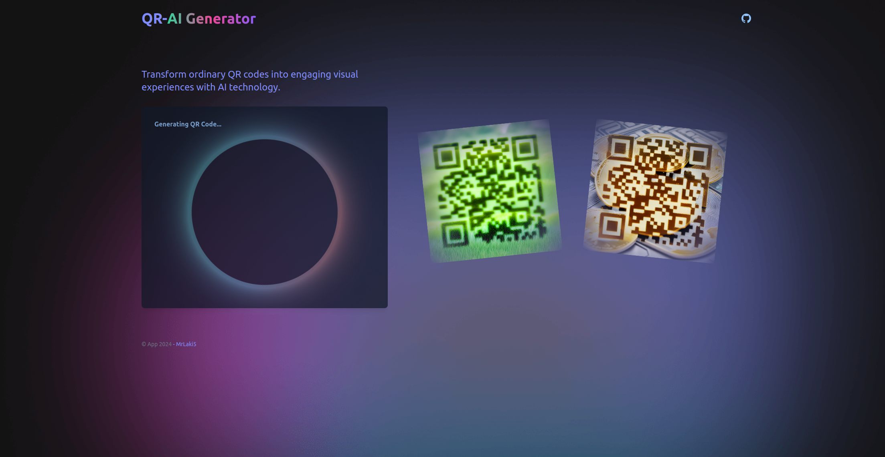
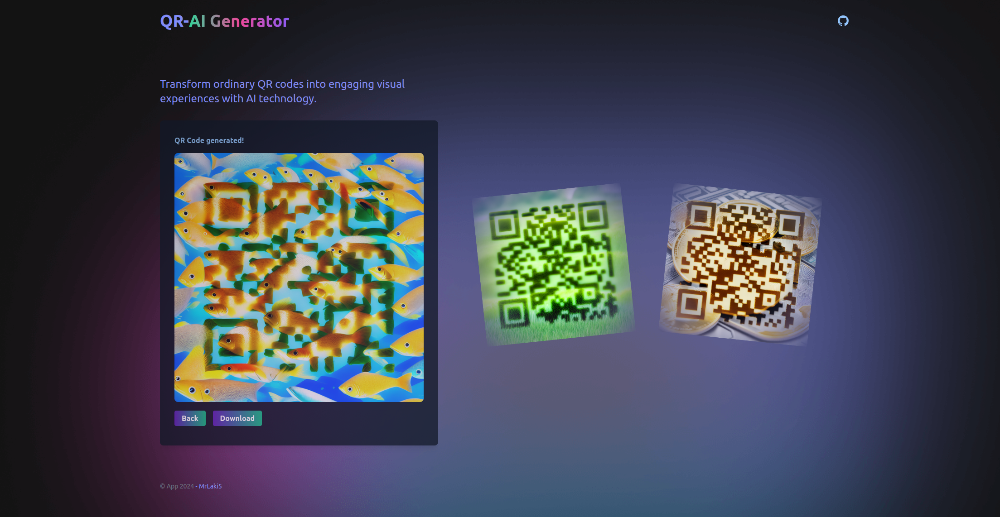

# QR-AI-generator
Transform ordinary QR codes into engaging visual experiences with AI technology.

## Overview
Our service streamlines the process of creating visually enhanced QR codes through a user-friendly three-screen interface.
<div style="display: flex; justify-content: space-between;">
  
  
</div>
<div style="display: flex; justify-content: space-between; margin-top: 16px;">
  
</div>

## Setup
### Required dependencies
* [Docker](https://docs.docker.com/engine/install/)
* [Docker compose](https://docs.docker.com/compose/install/)
* [Nvidia container toolkit](https://docs.nvidia.com/datacenter/cloud-native/container-toolkit/latest/install-guide.html)
### Clone the repo
``` bash
git clone https://github.com/MrLaki5/QR-AI-generator.git
git lfs install
git submodule update --init --recursive
```
### Start the application
```
docker compose up -d
```
### Open starting page in browser on link below
[localhost:8089](http://localhost:8089)

## Deployment
The project includes a [deployment file](deploy.yaml) specifically designed for deployment on the [Akash Network](https://akash.network/). All the latest docker images used in deployment file can be found on links [worker](https://hub.docker.com/repository/docker/mrlaki5/qr-ai-generator-worker/general) and [server](https://hub.docker.com/repository/docker/mrlaki5/qr-ai-generator-server/general).

## References
### AI Models
This project utilizes open-source AI models.
* [stable_diffusion_v1_5](https://huggingface.co/runwayml/stable-diffusion-v1-5)
* [controlnet_v1p_sd15](https://huggingface.co/DionTimmer/controlnet_qrcode-control_v1p_sd15)
