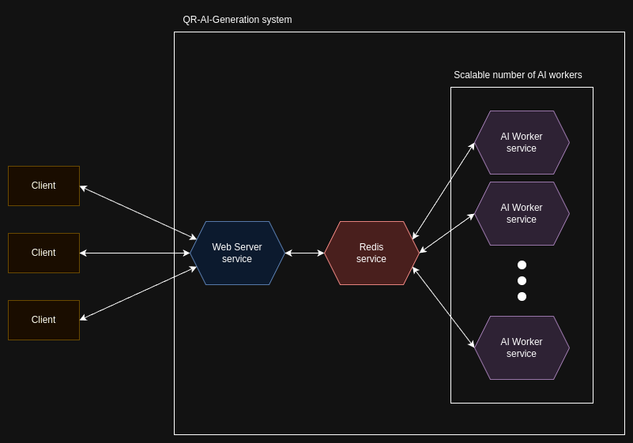

# QR-AI-generator
Transform ordinary QR codes into engaging visual experiences with our advanced AI-powered application. Our scalable architecture ensures efficient QR code generation, leveraging a web server for client interaction, Redis for task and result management, and multiple AI worker instances for high-performance processing. Enhance your QR codes with unique and visually appealing designs, making them not just functional, but also captivating for your audience. Additionally, our application is deployable to the Akash Network, utilizing a decentralized cloud provider to ensure robust, secure, and cost-effective deployment options.

## Overview
Our application streamlines the process of creating visually enhanced QR codes through a user-friendly three-screen interface.
<div style="display: flex; justify-content: space-between;">
  
  
</div>
<div style="display: flex; justify-content: space-between; margin-top: 16px;">
  
</div>

## Architecture
The application consists of three primary services: a web server, Redis, and AI workers. The architecture ensures efficient handling of requests, task queuing, and scalable processing of QR code generation.
### Web Server service
* **Communication with Clients**: The web server interacts with clients through HTTP and WebSockets, providing the user interface and handling QR code generation requests.
* **Task Management**: It places QR code generation requests into the Redis queue and retrieves the results from the Redis result queue.
* **Result Delivery**: Once results are available, the web server sends them back to the clients.
### Redis Service
* **Task Queue**: Redis acts as a task queue, storing the QR code generation requests received from the web server.
* **Result Queue**: Redis also stores the generated QR code results that need to be sent back to the web server.
### AI Worker Service
* **Task Processing**: AI workers take tasks from the Redis task queue, process the QR code generation using AI algorithms, and put the results into the Redis result queue.
* **Scalability**: Multiple instances of the AI worker service can run simultaneously to handle a large number of requests, ensuring efficient and timely processing.
### Additional Features
* **Deployable to Akash Network**: The application is designed for easy deployment to the Akash Network, leveraging a decentralized cloud provider for robust, secure, and cost-effective deployment options.
* **Responsive UI**: The user interface is built with Tailwind CSS, ensuring a responsive and modern design that works seamlessly across various devices and screen sizes.
* **Disconnected Tasks Filtering**: If a user sends a task to the queue and then closes their browser, the system will filter out and remove the disconnected task to prevent unnecessary processing.
* **Queue Position Tracking**: Users can track their position in the queue in real-time, with live updates provided until their task is being processed.
### Diagram
Here’s a high-level diagram to illustrate the architecture:
<div>
    
</div>

## Setup
Getting started with our AI-powered QR code generator is straightforward and hassle-free, thanks to our fully containerized setup using Docker. Follow these simple steps to get everything up and running quickly.
### Prerequisites
* [Git lfs](https://git-lfs.com/)
* [Docker](https://docs.docker.com/engine/install/)
* [Docker compose](https://docs.docker.com/compose/install/)
* [Nvidia container toolkit](https://docs.nvidia.com/datacenter/cloud-native/container-toolkit/latest/install-guide.html)
### Clone the repo
``` bash
git clone https://github.com/MrLaki5/QR-AI-generator.git
git lfs install
git submodule update --init --recursive
```
### Start the application
```
docker compose up -d
```
### Open starting page in browser on link below
[localhost:8089](http://localhost:8089)

## Deployment
The project includes a [deployment file](deploy.yaml) specifically designed for deployment on the [Akash Network](https://akash.network/). All the latest docker images used in deployment file can be found on links [worker](https://hub.docker.com/repository/docker/mrlaki5/qr-ai-generator-worker/general) and [server](https://hub.docker.com/repository/docker/mrlaki5/qr-ai-generator-server/general).

## AI Models
This project utilizes open-source AI models.
* [unwayml/stable-diffusion-v1-5](https://huggingface.co/runwayml/stable-diffusion-v1-5): deep learning model primarily used for generating high-quality images from textual descriptions. It leverages a diffusion process to iteratively transform a noisy image into a clear, detailed output based on the input prompt. This model is widely used in various applications, including art generation, image editing, and creative content production.
* [DionTimmer/controlnet_qrcode-control_v1p_sd15](https://huggingface.co/DionTimmer/controlnet_qrcode-control_v1p_sd15): advanced neural network model designed to provide precise control over the image generation process. It extends the capabilities of stable diffusion models by integrating additional conditioning data, such as QR codes, into the image generation pipeline. This allows for the creation of images that seamlessly incorporate specific elements, like QR codes, while maintaining high visual quality and coherence.
